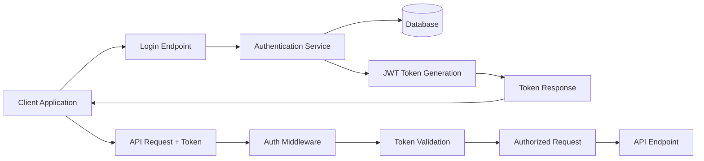
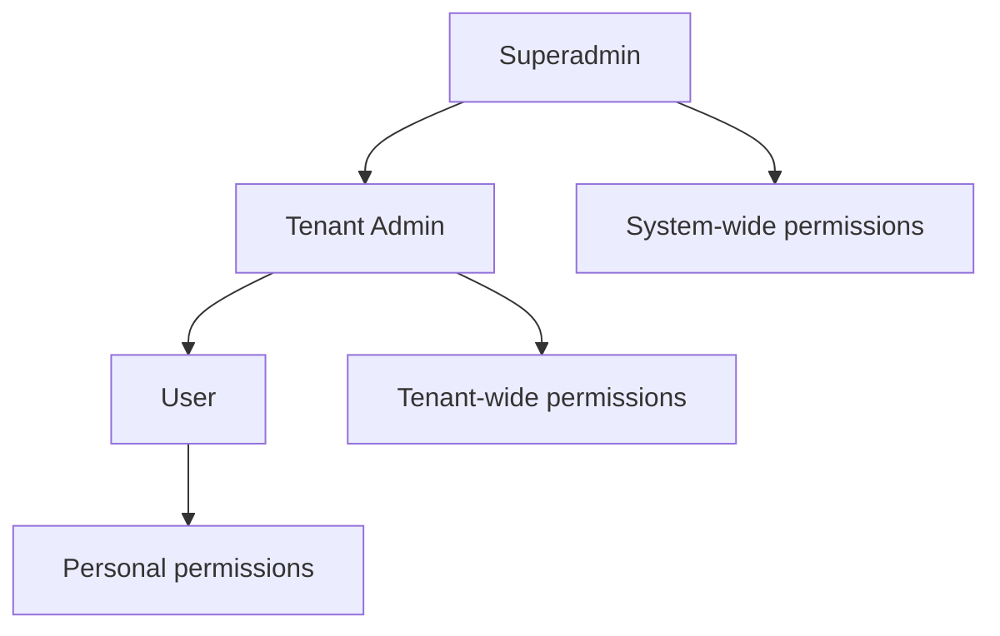

# Authentication & Authorization System

## Overview

The MNFST-RAG Backend implements a comprehensive authentication and authorization system designed for multi-tenant applications. The system uses JWT (JSON Web Tokens) for authentication and Role-Based Access Control (RBAC) for authorization.

## Authentication Architecture



## Authentication Flow

### 1. User Login

**Endpoint**: `POST /api/v1/auth/login`

**Request**:
```json
{
  "email": "user@example.com",
  "password": "user-password"
}
```

**Response**:
```json
{
  "user": {
    "id": "uuid",
    "email": "user@example.com",
    "name": "User Name",
    "role": "user",
    "tenant_id": "tenant-uuid",
    "created_at": "2023-01-01T00:00:00Z",
    "updated_at": "2023-01-01T00:00:00Z"
  },
  "tokens": {
    "access_token": "jwt-access-token",
    "refresh_token": "jwt-refresh-token",
    "expires_in": 3600
  }
}
```

### 2. Token Refresh

**Endpoint**: `POST /api/v1/auth/refresh`

**Request**:
```json
{
  "refresh_token": "jwt-refresh-token"
}
```

**Response**:
```json
{
  "access_token": "new-jwt-access-token",
  "expires_in": 3600
}
```

### 3. User Logout

**Endpoint**: `POST /api/v1/auth/logout`

**Response**:
```json
{
  "success": true,
  "message": "Logged out successfully"
}
```

### 4. Current User Info

**Endpoint**: `GET /api/v1/auth/me`

**Response**:
```json
{
  "id": "uuid",
  "email": "user@example.com",
  "name": "User Name",
  "role": "user",
  "tenant_id": "tenant-uuid",
  "created_at": "2023-01-01T00:00:00Z",
  "updated_at": "2023-01-01T00:00:00Z"
}
```

## JWT Token Structure

### Access Token

**Header**:
```json
{
  "alg": "HS256",
  "typ": "JWT"
}
```

**Payload**:
```json
{
  "sub": "user-uuid",
  "email": "user@example.com",
  "role": "user",
  "tenant_id": "tenant-uuid",
  "exp": 1640995200,
  "iat": 1640991600,
  "type": "access"
}
```

### Refresh Token

**Payload**:
```json
{
  "sub": "user-uuid",
  "exp": 1643587200,
  "iat": 1640991600,
  "type": "refresh"
}
```

## Role-Based Access Control (RBAC)

### Role Hierarchy

The system implements a three-tier role hierarchy:



### 1. Superadmin

**Scope**: System-wide access
**Permissions**:
- Manage all tenants (create, read, update, delete)
- Manage all users across all tenants
- Access system-wide analytics and reports
- Configure system settings
- No tenant association (`tenant_id` is null)

**API Access**:
- All tenant management endpoints
- All user management endpoints
- System administration endpoints

### 2. Tenant Admin

**Scope**: Single tenant
**Permissions**:
- Manage users within their tenant
- Manage documents within their tenant
- Manage social links for their tenant
- View tenant analytics and reports
- Cannot access other tenants' data

**API Access**:
- User management (filtered by tenant)
- Document management (filtered by tenant)
- Social link management (filtered by tenant)
- Tenant information (read-only for their tenant)

### 3. User

**Scope**: Personal access within tenant
**Permissions**:
- Upload and manage their own documents
- Participate in chat sessions
- View their own data
- Cannot manage other users or system settings

**API Access**:
- Document upload and management (own documents only)
- Chat functionality
- Personal profile management

## Authorization Implementation

### Current Status

The authentication and authorization system is now **fully implemented**:

- ✅ API endpoints with complete implementations
- ✅ Role-based data models implemented
- ✅ JWT token structure designed
- ✅ JWT token generation and validation using PyJWT
- ✅ Authentication middleware
- ✅ Authorization dependencies
- ✅ Password hashing and verification using bcrypt
- ✅ Token rotation for refresh tokens
- ✅ Multi-tenant security
- ✅ Role-based access control

### Planned Implementation

#### 1. JWT Service

```python
# app/services/jwt.py
class JWTService:
    def generate_access_token(self, user_id: str, email: str, role: str, tenant_id: Optional[str]) -> str
    def generate_refresh_token(self, user_id: str) -> str
    def validate_token(self, token: str) -> Optional[dict]
    def validate_access_token(self, token: str) -> Optional[dict]
    def validate_refresh_token(self, token: str) -> Optional[dict]
    def refresh_access_token(self, refresh_token: str) -> Optional[str]
```

#### 2. Authentication Service

```python
# app/services/auth.py
class AuthenticationService:
    def authenticate_user(self, email: str, password: str) -> Optional[User]
    def create_tokens(self, user: User) -> Tuple[str, str]
    def refresh_access_token(self, refresh_token: str) -> Optional[Tuple[str, str]]
    def get_user_from_token(self, token: str) -> Optional[User]
    def create_user_with_password(self, email: str, password: str, name: str, role: UserRole, tenant_id: Optional[str]) -> User
```

#### 3. Authentication Middleware

```python
# app/middleware/auth.py
class AuthenticationMiddleware:
    async def dispatch(self, request: Request, call_next: Callable) -> Response
    def _should_skip_auth(self, path: str) -> bool
```

#### 4. Authentication Dependencies

```python
# app/dependencies/auth.py
def get_current_user() -> User
def get_current_active_user() -> User
def require_role(required_role: UserRole) -> Callable
def require_tenant_access(tenant_id: Optional[str]) -> User
def get_optional_current_user() -> Optional[User]
```

#### 5. Password Service

```python
# app/services/password.py
class PasswordService:
    def hash_password(self, password: str) -> str
    def verify_password(self, password: str, hashed: str) -> bool
    def validate_password_strength(self, password: str) -> Tuple[bool, str]
```

#### 6. Authentication Exceptions

```python
# app/exceptions/auth.py
class AuthenticationError(HTTPException)
class InvalidCredentialsError(AuthenticationError)
class TokenExpiredError(AuthenticationError)
class InvalidTokenError(AuthenticationError)
class AuthorizationError(HTTPException)
class InsufficientRoleError(AuthorizationError)
class TenantAccessError(AuthorizationError)
```

## Security Considerations

### Token Security

1. **Token Storage**: 
   - Access tokens stored in memory (short-lived)
   - Refresh tokens stored securely (httpOnly cookies)

2. **Token Expiration**:
   - Access tokens: 1 hour
   - Refresh tokens: 30 days

3. **Token Revocation**:
   - Refresh token blacklist on logout
   - Token rotation on refresh

### Password Security

1. **Hashing**: bcrypt with salt
2. **Complexity Requirements**: Minimum 8 characters, mixed case, numbers
3. **Reset**: Secure password reset flow

### API Security

1. **HTTPS**: Required for all API calls
2. **CORS**: Configured for allowed origins
3. **Rate Limiting**: Prevent brute force attacks
4. **Input Validation**: Sanitize all inputs

## Multi-Tenant Security

### Data Isolation

1. **Tenant Filtering**: All queries filtered by tenant_id
2. **Ownership Verification**: Users can only access their own data
3. **Role Enforcement**: Strict role-based access control

### Authorization Rules

```python
# Example authorization logic
def can_access_resource(user: User, resource: dict, action: str) -> bool:
    if user.role == UserRole.SUPERADMIN:
        return True
    
    if user.role == UserRole.TENANT_ADMIN:
        return resource.get("tenant_id") == user.tenant_id
    
    if user.role == UserRole.USER:
        return resource.get("user_id") == user.id
    
    return False
```

## Error Handling

### Authentication Errors

- `401 Unauthorized`: Invalid or missing token
- `403 Forbidden`: Insufficient permissions
- `422 Unprocessable Entity`: Invalid credentials format

### Error Response Format

```json
{
  "success": false,
  "error": {
    "code": "UNAUTHORIZED",
    "message": "Invalid or expired token"
  }
}
```

## Integration with Frontend

### Token Management

1. **Login Flow**: Store tokens securely after successful login
2. **Token Refresh**: Automatically refresh expired access tokens
3. **Logout Flow**: Clear tokens and notify backend

### API Client

```typescript
// Example frontend integration
class AuthenticatedAPIClient {
  private accessToken: string;
  private refreshToken: string;
  
  async login(email: string, password: string): Promise<void>
  async refreshAccessToken(): Promise<void>
  async logout(): Promise<void>
  private async makeRequest(endpoint: string, options: RequestOptions): Promise<Response>
}
```

## Testing Strategy

### Unit Tests

1. **Token Generation/Validation**: Verify JWT operations
2. **Password Hashing**: Test password security
3. **Authorization Logic**: Test role-based access

### Integration Tests

1. **Authentication Flow**: End-to-end login/logout
2. **Authorization Scenarios**: Test role-based access
3. **Multi-Tenant Isolation**: Verify data separation

### Security Tests

1. **Token Manipulation**: Attempt token tampering
2. **Privilege Escalation**: Test unauthorized access
3. **Injection Attacks**: SQL injection prevention

## Monitoring and Logging

### Authentication Events

1. **Login Attempts**: Success/failure logging
2. **Token Usage**: Track token validation
3. **Authorization Failures**: Log denied access

### Security Metrics

1. **Failed Login Rate**: Monitor for attacks
2. **Token Refresh Frequency**: Track token usage
3. **Authorization Denials**: Monitor access patterns

## Future Enhancements

### Advanced Features

1. **Multi-Factor Authentication**: TOTP/SMS support
2. **Social Login**: OAuth integration (Google, GitHub)
3. **API Keys**: Machine-to-machine authentication
4. **Session Management**: Active session tracking
5. **Audit Logging**: Comprehensive audit trail

### Security Improvements

1. **Device Fingerprinting**: Detect suspicious logins
2. **Anomaly Detection**: Identify unusual behavior
3. **Rate Limiting**: Advanced rate limiting per user/IP
4. **Web Application Firewall**: Additional protection layer