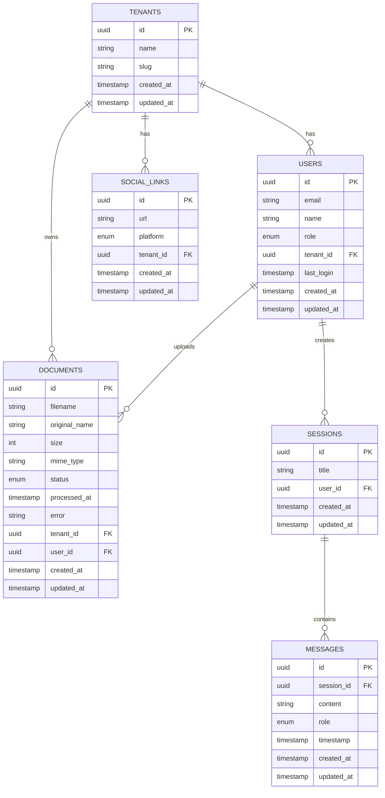

# Database Schema

## Overview

The MNFST-RAG Backend uses SQLModel with PostgreSQL as the database. The schema is designed to support multi-tenancy, role-based access control, and the core functionality of document management and chat systems.

## Entity Relationship Diagram

## Table Details

### 1. Tenants Table

**Purpose**: Stores multi-tenant organization information

**Table Name**: `tenants`

**Columns**:
- `id` (UUID, Primary Key) - Unique identifier
- `name` (String) - Display name of the tenant
- `slug` (String, Indexed) - URL-safe identifier for the tenant
- `created_at` (Timestamp) - Record creation time
- `updated_at` (Timestamp) - Last update time

**Model**: [`Tenant`](../../app/models/tenant.py)

**Relationships**:
- One-to-many with Users
- One-to-many with Documents
- One-to-many with Social Links

### 2. Users Table

**Purpose**: Stores user information with role-based access control

**Table Name**: `users`

**Columns**:
- `id` (UUID, Primary Key) - Unique identifier
- `email` (String, Indexed) - User's email address
- `name` (String) - User's full name
- `role` (Enum) - User role (superadmin, tenant_admin, user)
- `tenant_id` (UUID, Indexed, Foreign Key) - Associated tenant (null for superadmin)
- `last_login` (Timestamp) - Last login time
- `created_at` (Timestamp) - Record creation time
- `updated_at` (Timestamp) - Last update time

**Model**: [`User`](../../app/models/user.py)

**Roles**:
- `superadmin` - System-wide access, no tenant association
- `tenant_admin` - Tenant-level administrative access
- `user` - Standard user with limited access

**Relationships**:
- Many-to-one with Tenants
- One-to-many with Documents (as uploader)
- One-to-many with Sessions

### 3. Documents Table

**Purpose**: Stores document metadata and processing status

**Table Name**: `documents`

**Columns**:
- `id` (UUID, Primary Key) - Unique identifier
- `filename` (String) - System-generated filename
- `original_name` (String) - Original upload filename
- `size` (Integer) - File size in bytes
- `mime_type` (String) - MIME type of the file
- `status` (Enum) - Processing status (uploaded, processing, processed, error)
- `processed_at` (Timestamp) - Processing completion time
- `error` (String) - Error message if processing failed
- `tenant_id` (UUID, Indexed, Foreign Key) - Owning tenant
- `user_id` (UUID, Indexed, Foreign Key) - User who uploaded
- `created_at` (Timestamp) - Record creation time
- `updated_at` (Timestamp) - Last update time

**Model**: [`Document`](../../app/models/document.py)

**Status Values**:
- `uploaded` - File uploaded, awaiting processing
- `processing` - Currently being processed for RAG
- `processed` - Successfully processed and indexed
- `error` - Processing failed

**Relationships**:
- Many-to-one with Tenants
- Many-to-one with Users

### 4. Social Links Table

**Purpose**: Stores social media links for tenants

**Table Name**: `social_links`

**Columns**:
- `id` (UUID, Primary Key) - Unique identifier
- `url` (String) - Social media URL
- `platform` (Enum) - Social media platform
- `tenant_id` (UUID, Indexed, Foreign Key) - Associated tenant
- `created_at` (Timestamp) - Record creation time
- `updated_at` (Timestamp) - Last update time

**Model**: [`SocialLink`](../../app/models/social.py)

**Platform Values**:
- `twitter`
- `facebook`
- `linkedin`
- `instagram`
- `youtube`

**Relationships**:
- Many-to-one with Tenants

### 5. Chat Sessions Table

**Purpose**: Stores chat session information

**Table Name**: `sessions`

**Columns**:
- `id` (UUID, Primary Key) - Unique identifier
- `title` (String) - Session title
- `user_id` (UUID, Indexed, Foreign Key) - Session owner
- `created_at` (Timestamp) - Record creation time
- `updated_at` (Timestamp) - Last update time

**Model**: [`Session`](../../app/models/chat.py)

**Relationships**:
- Many-to-one with Users
- One-to-many with Messages

### 6. Messages Table

**Purpose**: Stores chat messages within sessions

**Table Name**: `messages`

**Columns**:
- `id` (UUID, Primary Key) - Unique identifier
- `session_id` (UUID, Indexed, Foreign Key) - Associated session
- `content` (String) - Message content
- `role` (Enum) - Message role (user, assistant)
- `timestamp` (Timestamp) - Message timestamp
- `created_at` (Timestamp) - Record creation time
- `updated_at` (Timestamp) - Last update time

**Model**: [`Message`](../../app/models/chat.py)

**Role Values**:
- `user` - Message from user
- `assistant` - Response from AI assistant

**Relationships**:
- Many-to-one with Sessions

## Base Model

All tables extend the [`BaseSQLModel`](../../app/models/base.py) which provides common fields:

- `id` (UUID) - Primary key with UUID generation
- `created_at` (Timestamp) - Auto-generated creation timestamp
- `updated_at` (Timestamp) - Auto-updated modification timestamp

## Multi-Tenant Data Isolation

The schema implements multi-tenancy through:

1. **Tenant Scoping**: All tenant-specific data includes `tenant_id`
2. **User Association**: Users are associated with tenants (except superadmins)
3. **Data Isolation**: Queries filter by tenant to ensure data isolation

## Indexes

The following indexes are defined for performance:

### Primary Indexes
- All tables have primary key indexes on `id`

### Foreign Key Indexes
- `users.tenant_id`
- `documents.tenant_id`
- `documents.user_id`
- `social_links.tenant_id`
- `sessions.user_id`
- `messages.session_id`

### Unique Indexes
- `tenants.slug` - Ensures unique tenant slugs
- `users.email` - Ensures unique email addresses

## Data Validation

### Field Constraints
- Email format validation for user emails
- Enum validation for status and role fields
- Size constraints on text fields
- Non-null constraints on required fields

### Business Logic Validation
- Tenant admins can only manage users within their tenant
- Users can only access their own data
- Document status transitions follow defined workflows

## Migration Strategy

### Current Status
- Schema is defined but tables are not yet created
- Database connection is configured but not active

### Planned Implementation
1. **Initial Migration**: Create all tables with current schema
2. **Data Seeding**: Populate with initial data for development
3. **Migration Scripts**: Alembic for schema changes
4. **Backup Strategy**: Regular backups before migrations

## Performance Considerations

### Query Optimization
- Indexed foreign keys for fast joins
- Tenant-based filtering for multi-tenancy
- Pagination for large result sets

### Storage Optimization
- UUID primary keys for distributed systems
- Timestamp fields for temporal queries
- Appropriate data types for storage efficiency

## Security Considerations

### Data Access Control
- Row-level security through tenant filtering
- Role-based access through application logic
- Sensitive data protection through field-level access

### Data Integrity
- Foreign key constraints prevent orphaned records
- Unique constraints prevent duplicate data
- Not null constraints ensure required data

## Future Enhancements

### Planned Schema Changes
1. **Audit Trail**: Add audit tables for change tracking
2. **Soft Deletes**: Implement soft delete functionality
3. **Document Chunks**: Table for RAG document chunks
4. **Embeddings**: Table for vector embeddings
5. **User Preferences**: Table for user settings
6. **API Keys**: Table for API key management

### Performance Improvements
1. **Partitioning**: Table partitioning for large datasets
2. **Materialized Views**: For complex reporting queries
3. **Connection Pooling**: Optimized database connections
4. **Caching Layer**: Redis for frequently accessed data