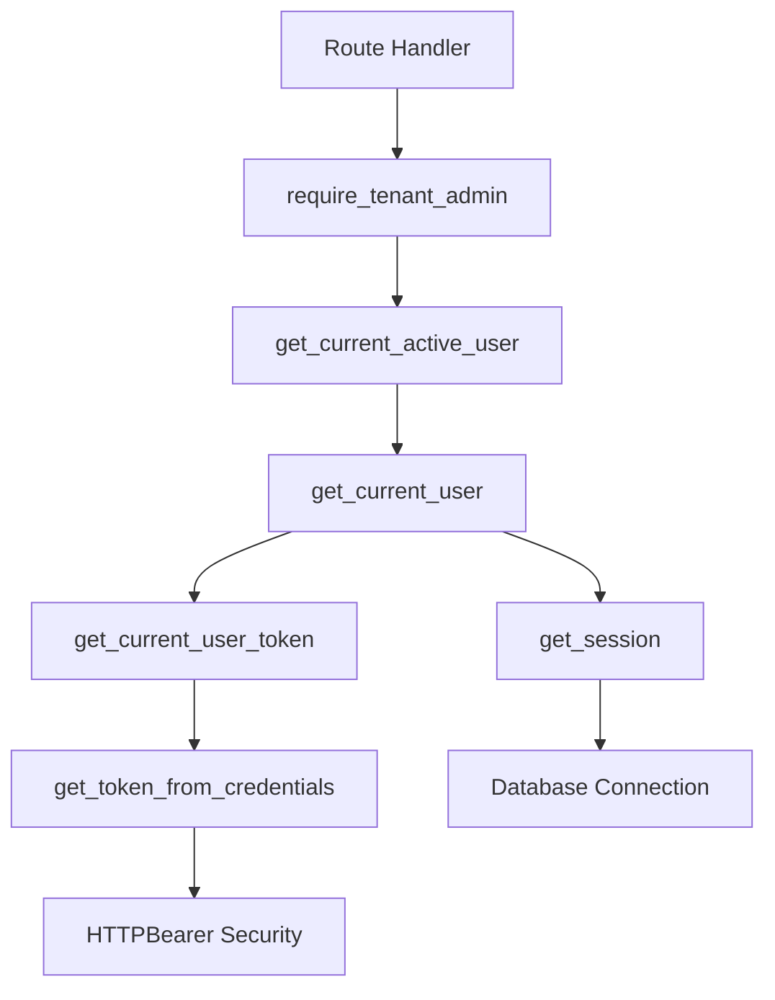

# Dependency Injection in FastAPI

## Overview

Dependency Injection (DI) is a design pattern that implements Inversion of Control (IoC) for resolving dependencies between components. FastAPI has a powerful dependency injection system that helps manage dependencies, reduce code duplication, and improve testability.

This document explains how dependency injection works in FastAPI, using the user authentication system as a comprehensive example, and demonstrates how middleware and dependency injection work together.

## What is Dependency Injection?

Dependency Injection is a technique where an object's dependencies are "injected" from an external source rather than being created internally. In FastAPI, this is handled through the `Depends()` class.

### Benefits of Dependency Injection

1. **Code Reusability**: Use the same dependency in multiple routes
2. **Separation of Concerns**: Keep business logic separate from infrastructure code
3. **Testability**: Easily mock dependencies for testing
4. **Documentation**: Automatic API documentation generation
5. **Type Safety**: Full IDE support with type hints

## FastAPI Dependency Injection Basics

### Simple Dependency Example

```python
from fastapi import Depends, FastAPI

app = FastAPI()

# Simple dependency function
def get_common_parameters():
    return {"message": "Hello", "status": "active"}

@app.get("/items/")
async def read_items(common: dict = Depends(get_common_parameters)):
    return {"items": [], "common": common}
```

### Dependency with Parameters

```python
from fastapi import Depends, HTTPException, status
from typing import Optional

def get_item_limit(limit: int = 10, skip: int = 0):
    return {"limit": limit, "skip": skip}

@app.get("/items/")
async def read_items(params: dict = Depends(get_item_limit)):
    return {"limit": params["limit"], "skip": params["skip"]}
```

## User Authentication Dependency Chain

The user authentication system in our application demonstrates a sophisticated dependency chain. Let's break down each component:

### Dependency Chain Overview



### 1. Token Extraction: `get_token_from_credentials`

```python
# app/dependencies/auth.py
def get_token_from_credentials(credentials: HTTPAuthorizationCredentials = Depends(security)) -> str:
    """
    Extract token from HTTP Authorization header
    
    Args:
        credentials: HTTP Authorization credentials
        
    Returns:
        Token string
    """
    return credentials.credentials
```

This is the first dependency in the chain that:
- Uses FastAPI's `HTTPBearer` security scheme
- Extracts the Bearer token from the Authorization header
- Returns just the token string

### 2. Token Validation: `get_current_user_token`

```python
def get_current_user_token(
    token: str = Depends(get_token_from_credentials)
) -> dict:
    """
    Get current user token payload
    
    Args:
        token: JWT token
        
    Returns:
        Token payload
        
    Raises:
        AuthenticationError: If token is invalid or expired
    """
    payload = jwt_service.validate_access_token(token)
    if not payload:
        raise AuthenticationError(detail="Invalid or expired token")
    
    return payload
```

This dependency:
- Depends on `get_token_from_credentials`
- Validates the JWT token using the JWT service
- Returns the token payload if valid
- Raises an exception if the token is invalid

### 3. User Retrieval: `get_current_user`

```python
def get_current_user(
    token_payload: dict = Depends(get_current_user_token),
    session: Session = Depends(get_session)
) -> User:
    """
    Get current authenticated user
    
    Args:
        token_payload: Token payload
        session: Database session
        
    Returns:
        Current user object
        
    Raises:
        AuthenticationError: If user is not found
    """
    user_id = token_payload.get("sub")
    if not user_id:
        raise AuthenticationError(detail="Invalid token payload")
    
    from sqlmodel import select
    
    statement = select(User).where(User.id == user_id)
    user = session.exec(statement).first()
    
    if not user:
        raise AuthenticationError(detail="User not found")
    
    return user
```

This dependency:
- Depends on `get_current_user_token` for the token payload
- Depends on `get_session` for database access
- Extracts the user ID from the token payload
- Queries the database to get the full user object
- Returns the complete User model

### 4. Active User Check: `get_current_active_user`

```python
def get_current_active_user(
    current_user: User = Depends(get_current_user)
) -> User:
    """
    Get current active user
    
    Args:
        current_user: Current user
        
    Returns:
        Current active user
    """
    # Add any additional checks for user status if needed
    return current_user
```

This dependency:
- Depends on `get_current_user`
- Can be extended with additional checks (e.g., account status)
- Currently just passes through the user

### 5. Role-Based Access: `require_role` Factory

```python
def require_role(required_role: UserRole):
    """
    Create a dependency that requires a specific role or higher
    
    Args:
        required_role: Minimum required role
        
    Returns:
        Dependency function
    """
    def role_dependency(
        current_user: User = Depends(get_current_active_user)
    ) -> User:
        # Define role hierarchy
        role_hierarchy = {
            UserRole.USER: 0,
            UserRole.TENANT_ADMIN: 1,
            UserRole.SUPERADMIN: 2
        }
        
        user_level = role_hierarchy.get(current_user.role, 0)
        required_level = role_hierarchy.get(required_role, 0)
        
        if user_level < required_level:
            raise InsufficientRoleError(required_role.value)
        
        return current_user
    
    return role_dependency
```

This is a **dependency factory** that:
- Takes a required role as a parameter
- Returns a customized dependency function
- The returned function checks if the user has sufficient privileges
- Uses a closure to capture the `required_role` parameter

### 6. Pre-configured Role Dependencies

```python
# Common role dependencies
require_superadmin = require_role(UserRole.SUPERADMIN)
require_tenant_admin = require_role(UserRole.TENANT_ADMIN)
require_user = require_role(UserRole.USER)
```

These are pre-configured dependencies that can be used directly in route handlers.

## Usage in Route Handlers

### Basic Authentication

```python
@router.get("/me")
async def get_current_user_info(
    current_user: User = Depends(get_current_active_user)
) -> Any:
    """
    Get current user information
    """
    return UserRead.from_orm(current_user)
```

### Role-Based Access

```python
@router.get("/")
async def get_users(
    page: int = Query(1, ge=1, description="Page number"),
    limit: int = Query(20, ge=1, le=100, description="Items per page"),
    current_user: User = Depends(require_tenant_admin),  # Requires tenant admin or higher
    session = Depends(get_session)
) -> Any:
    """
    Get users (tenant admin only)
    """
    # Implementation here
```

### Custom Role Check

```python
@router.post("/admin-only")
async def admin_only_action(
    current_user: User = Depends(require_role(UserRole.SUPERADMIN))
) -> Any:
    """
    Superadmin-only action
    """
    # Implementation here
```

## Middleware and Dependency Injection

### Authentication Middleware

The application also uses middleware for authentication:

```python
# app/middleware/auth.py
class AuthenticationMiddleware(BaseHTTPMiddleware):
    """
    Middleware to handle authentication for protected routes
    """
    
    async def dispatch(self, request: Request, call_next: Callable) -> Response:
        # Skip authentication for certain paths
        if self._should_skip_auth(request.url.path):
            return await call_next(request)
        
        # Extract token from Authorization header
        authorization = request.headers.get("Authorization")
        if not authorization or not authorization.startswith("Bearer "):
            # No token provided, continue without authentication
            # The route will handle authentication if needed
            return await call_next(request)
        
        token = authorization.split(" ")[1]
        
        try:
            # Validate token
            payload = jwt_service.validate_access_token(token)
            if payload:
                # Add user info to request state
                request.state.user_id = payload.get("sub")
                request.state.user_email = payload.get("email")
                request.state.user_role = payload.get("role")
                request.state.tenant_id = payload.get("tenant_id")
                request.state.token_payload = payload
        except Exception:
            # Invalid token, continue without authentication
            # The route will handle authentication if needed
            pass
        
        return await call_next(request)
```

### How Middleware and Dependencies Work Together

1. **Middleware** runs before the request reaches the route handler
2. **Middleware** extracts and validates the token, storing information in `request.state`
3. **Dependencies** run when the route handler is executed
4. **Dependencies** can use the information stored by middleware or perform their own validation

### Benefits of This Approach

1. **Performance**: Middleware can reject invalid requests early
2. **Flexibility**: Routes can still have their own authentication requirements
3. **Information Sharing**: Middleware can make information available to all parts of the application
4. **Separation of Concerns**: Middleware handles request-level concerns, dependencies handle route-level concerns

### Accessing Middleware Data in Dependencies

```python
def get_current_user_from_middleware(request: Request) -> Optional[User]:
    """
    Get user from middleware-stored data
    """
    if hasattr(request.state, "user_id"):
        # User was authenticated by middleware
        return {
            "id": request.state.user_id,
            "email": request.state.user_email,
            "role": request.state.user_role,
            "tenant_id": request.state.tenant_id
        }
    return None
```

## Advanced Dependency Patterns

### Dependencies with Classes

```python
class CommonQueryParams:
    def __init__(
        self,
        limit: int = Query(10, le=100),
        skip: int = Query(0, ge=0),
        search: Optional[str] = Query(None)
    ):
        self.limit = limit
        self.skip = skip
        self.search = search

@app.get("/items/")
async def read_items(commons: CommonQueryParams = Depends()):
    return {"limit": commons.limit, "skip": commons.skip, "search": commons.search}
```

### Dependencies with Context Managers

```python
from contextlib import asynccontextmanager

@asynccontextmanager
async def get_db_session():
    session = SessionLocal()
    try:
        yield session
        session.commit()
    except Exception:
        session.rollback()
        raise
    finally:
        session.close()

@app.get("/items/")
async def read_items(session: Session = Depends(get_db_session)):
    # Use session
    pass
```

### Optional Dependencies

```python
from typing import Optional

def get_optional_current_user(
    token: Optional[str] = Depends(get_token_from_credentials)
) -> Optional[User]:
    """
    Get current user if token is provided, without raising exceptions
    """
    if not token:
        return None
    
    try:
        payload = jwt_service.validate_access_token(token)
        if not payload:
            return None
        
        return auth_service.get_user_from_token(token)
    except Exception:
        return None

@app.get("/public-data/")
async def get_public_data(
    user: Optional[User] = Depends(get_optional_current_user)
):
    if user:
        return {"data": "personalized", "user": user.email}
    return {"data": "public"}
```

## Best Practices

### 1. Keep Dependencies Focused

Each dependency should have a single responsibility:

```python
# Good: Single responsibility
def get_current_user() -> User:
    # Only gets the current user
    pass

# Bad: Multiple responsibilities
def get_current_user_and_validate_permissions() -> User:
    # Gets user AND validates permissions
    pass
```

### 2. Use Descriptive Names

```python
# Good: Descriptive name
def get_current_active_user() -> User:
    pass

# Bad: Vague name
def get_user() -> User:
    pass
```

### 3. Handle Errors Appropriately

```python
def get_current_user() -> User:
    try:
        # Authentication logic
        pass
    except AuthenticationError:
        # Re-raise with appropriate HTTP status
        raise HTTPException(
            status_code=status.HTTP_401_UNAUTHORIZED,
            detail="Invalid authentication credentials"
        )
```

### 4. Document Dependencies

```python
def get_current_user(
    token_payload: dict = Depends(get_current_user_token),
    session: Session = Depends(get_session)
) -> User:
    """
    Get current authenticated user from token
    
    Args:
        token_payload: Validated JWT token payload containing user ID
        session: Database session for user lookup
        
    Returns:
        User: Complete user object from database
        
    Raises:
        AuthenticationError: If user is not found in database
    """
    # Implementation
```

### 5. Test Dependencies Independently

```python
def test_get_current_user():
    # Create mock token payload
    mock_payload = {"sub": "user-123"}
    
    # Create mock session
    mock_session = Mock()
    mock_user = User(id="user-123", email="test@example.com")
    mock_session.exec.return_value.first.return_value = mock_user
    
    # Test the dependency
    result = get_current_user(mock_payload, mock_session)
    
    assert result.id == "user-123"
    assert result.email == "test@example.com"
```

## Testing with Dependencies

### Overriding Dependencies for Testing

```python
from fastapi.testclient import TestClient

app = FastAPI()

# Override dependency for testing
@app.get("/protected")
async def protected_route(current_user: User = Depends(get_current_user)):
    return {"user_id": current_user.id}

# Test client with overridden dependency
def test_protected_route():
    def mock_get_current_user():
        return User(id="test-user", email="test@example.com")
    
    app.dependency_overrides[get_current_user] = mock_get_current_user
    
    with TestClient(app) as client:
        response = client.get("/protected")
        assert response.json() == {"user_id": "test-user"}
    
    # Clean up
    app.dependency_overrides.clear()
```

## Performance Considerations

### 1. Dependency Caching

FastAPI caches dependencies within a single request by default:

```python
# This will only be called once per request, even if used multiple times
def get_db_session():
    return SessionLocal()

@app.get("/route1")
async def route1(session1: Session = Depends(get_db_session)):
    pass

@app.get("/route2")
async def route2(session2: Session = Depends(get_db_session)):
    pass
```

### 2. Use `use_cache=False` for Fresh Dependencies

```python
def get_current_timestamp():
    return datetime.now()

# Will get fresh timestamp each time
@app.get("/time")
async def get_time(
    timestamp1: datetime = Depends(get_current_timestamp, use_cache=False),
    timestamp2: datetime = Depends(get_current_timestamp, use_cache=False)
):
    return {"timestamp1": timestamp1, "timestamp2": timestamp2}
```

## Conclusion

FastAPI's dependency injection system provides a powerful and flexible way to manage dependencies in your application. The user authentication system demonstrates how complex dependency chains can be built to handle authentication, authorization, and other cross-cutting concerns.

Key takeaways:

1. **Dependencies are composable**: Build complex behavior from simple, focused dependencies
2. **Factory patterns enable parameterization**: Create dependencies with different configurations
3. **Middleware and dependencies complement each other**: Use middleware for request-level concerns and dependencies for route-level concerns
4. **Testing is straightforward**: Override dependencies for easy testing
5. **Performance is optimized**: FastAPI caches dependencies within requests

By following these patterns and best practices, you can build maintainable, testable, and efficient applications with FastAPI's dependency injection system.