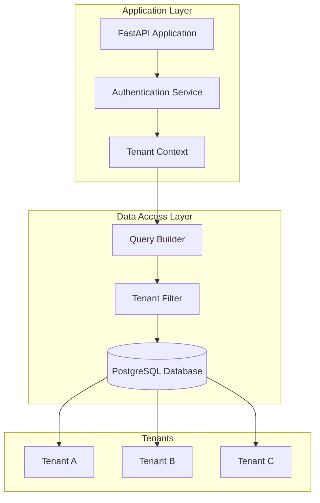
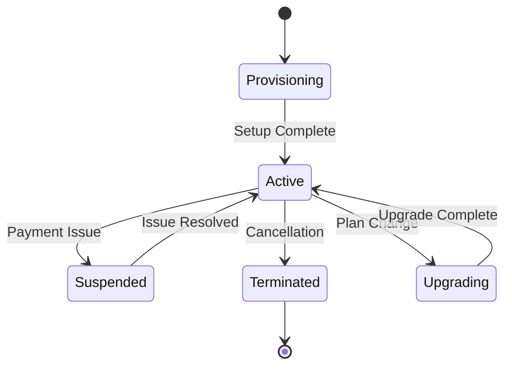
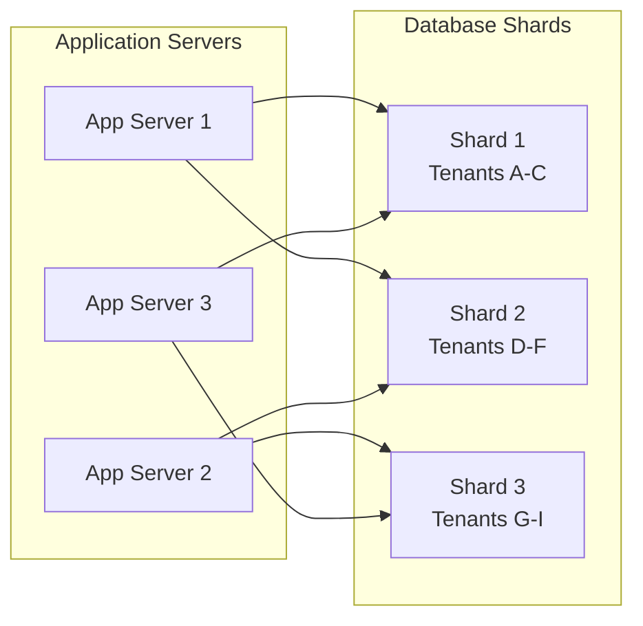

# Multi-Tenant Architecture

## Overview

The MNFST-RAG Backend is designed as a multi-tenant SaaS application, allowing multiple organizations (tenants) to share the same infrastructure while maintaining complete data isolation and security. This architecture enables cost efficiency, simplified maintenance, and rapid scaling while ensuring tenant privacy and customization.

## Multi-Tenancy Model

### Tenant Isolation Strategy

The application implements **row-level security** with a **shared database, shared schema** approach:



### Isolation Levels

1. **Data Isolation**: Each tenant's data is separated by `tenant_id` in all tables
2. **Application Isolation**: Tenant-specific logic and configurations
3. **Security Isolation**: Role-based access control within tenant boundaries
4. **Resource Isolation**: Tenant-specific resource allocation (planned)

## Tenant Data Model

### Core Tenant Entity

```python
# app/models/tenant.py
class Tenant(BaseSQLModel, table=True):
    __tablename__ = "tenants"
    
    id: UUID = Field(primary_key=True)
    name: str = Field(description="Tenant display name")
    slug: str = Field(unique=True, index=True, description="URL-safe identifier")
    created_at: datetime = Field(default_factory=datetime.utcnow)
    updated_at: datetime = Field(default_factory=datetime.utcnow)
    
    # Relationships
    users: List["User"] = Relationship(back_populates="tenant")
    documents: List["Document"] = Relationship(back_populates="tenant")
    social_links: List["SocialLink"] = Relationship(back_populates="tenant")
```

### Tenant-Scoped Models

All tenant-specific data models include a `tenant_id` field:

```python
# Example: User model
class User(BaseSQLModel, table=True):
    id: UUID = Field(primary_key=True)
    email: str = Field(unique=True, index=True)
    name: str
    role: UserRole
    tenant_id: Optional[UUID] = Field(foreign_key="tenant.id", index=True)
    # ... other fields
```

## Tenant Context Management

### Tenant Resolution

The system uses multiple strategies to identify the current tenant:

1. **Authentication-Based**: Extracted from authenticated user's token
2. **Subdomain-Based**: From URL subdomain (planned)
3. **Header-Based**: From custom HTTP header (planned)

### Current Implementation

```python
# app/services/tenant.py
class TenantService:
    @staticmethod
    def get_tenant_from_user(user: User) -> Optional[Tenant]:
        """Extract tenant from authenticated user"""
        if user.role == UserRole.SUPERADMIN:
            return None
        return user.tenant
    
    @staticmethod
    def filter_by_tenant(query, tenant_id: UUID):
        """Apply tenant filtering to database queries"""
        return query.where(Model.tenant_id == tenant_id)
```

### Planned Enhancements

```python
# app/middleware/tenant.py
class TenantMiddleware:
    async def __call__(self, request: Request, call_next):
        # Extract tenant from various sources
        tenant_id = self.extract_tenant_id(request)
        
        # Set tenant context
        request.state.tenant_id = tenant_id
        
        response = await call_next(request)
        return response
    
    def extract_tenant_id(self, request: Request) -> Optional[UUID]:
        # 1. From authenticated user
        # 2. From subdomain
        # 3. From header
        # 4. From URL parameter
        pass
```

## Tenant Management

### Tenant Lifecycle



### Tenant Provisioning Process

1. **Tenant Creation**: Create tenant record in database
2. **Admin User**: Create tenant admin user
3. **Initial Setup**: Configure tenant settings
4. **Resource Allocation**: Allocate database resources
5. **Welcome Process**: Send welcome email and setup instructions

### Tenant Configuration

```python
# app/models/tenant.py
class TenantSettings(BaseSQLModel, table=True):
    __tablename__ = "tenant_settings"
    
    id: UUID = Field(primary_key=True)
    tenant_id: UUID = Field(foreign_key="tenant.id")
    
    # Feature flags
    enable_chat: bool = True
    enable_document_upload: bool = True
    enable_social_links: bool = True
    
    # Limits
    max_users: int = 100
    max_documents: int = 1000
    max_storage_mb: int = 10240
    
    # Customization
    primary_color: str = "#007bff"
    logo_url: Optional[str] = None
    custom_domain: Optional[str] = None
```

## Multi-Tenant Security

### Data Access Control

```python
# app/services/tenant_access.py
class TenantAccessService:
    @staticmethod
    def can_access_tenant(user: User, tenant_id: UUID) -> bool:
        """Check if user can access tenant data"""
        if user.role == UserRole.SUPERADMIN:
            return True
        
        return user.tenant_id == tenant_id
    
    @staticmethod
    def filter_user_query(user: User, query):
        """Apply tenant filtering based on user role"""
        if user.role == UserRole.SUPERADMIN:
            return query  # No filtering for superadmin
        
        return query.where(Model.tenant_id == user.tenant_id)
```

### Row-Level Security

```sql
-- Example SQL for row-level security (PostgreSQL)
CREATE POLICY tenant_isolation ON documents
    FOR ALL TO application_user
    USING (tenant_id = current_setting('app.current_tenant_id')::uuid);

ALTER TABLE documents ENABLE ROW LEVEL SECURITY;
```

## Tenant-Specific Features

### Customization Options

1. **Branding**: Custom logos, colors, and themes
2. **Domain**: Custom domain mapping (planned)
3. **Email Templates**: Tenant-specific email templates
4. **Feature Flags**: Enable/disable features per tenant

### Resource Management

```python
# app/services/tenant_resources.py
class TenantResourceService:
    @staticmethod
    async def check_storage_limit(tenant_id: UUID) -> bool:
        """Check if tenant has exceeded storage limits"""
        used_storage = await DocumentService.get_total_storage(tenant_id)
        limit = await TenantService.get_storage_limit(tenant_id)
        return used_storage <= limit
    
    @staticmethod
    async def check_user_limit(tenant_id: UUID) -> bool:
        """Check if tenant has exceeded user limits"""
        user_count = await UserService.get_user_count(tenant_id)
        limit = await TenantService.get_user_limit(tenant_id)
        return user_count <= limit
```

## Multi-Tenant API Design

### Tenant-Aware Endpoints

All tenant-specific endpoints automatically filter by tenant:

```python
# app/api/v1/documents.py
@router.get("/documents")
async def get_documents(
    current_user: User = Depends(get_current_user),
    db: Session = Depends(get_session)
):
    # Automatically filtered by tenant
    query = select(Document).where(Document.tenant_id == current_user.tenant_id)
    documents = db.exec(query).all()
    return documents
```

### Cross-Tenant Operations (Superadmin Only)

```python
# app/api/v1/tenants.py
@router.get("/tenants/{tenant_id}/users")
async def get_tenant_users(
    tenant_id: UUID,
    current_user: User = Depends(require_superadmin),
    db: Session = Depends(get_session)
):
    # Superadmin can access any tenant's data
    query = select(User).where(User.tenant_id == tenant_id)
    users = db.exec(query).all()
    return users
```

## Tenant Analytics and Reporting

### Metrics Collection

```python
# app/services/tenant_analytics.py
class TenantAnalyticsService:
    @staticmethod
    async def get_tenant_usage_stats(tenant_id: UUID) -> dict:
        """Get usage statistics for a tenant"""
        return {
            "user_count": await UserService.get_user_count(tenant_id),
            "document_count": await DocumentService.get_document_count(tenant_id),
            "storage_used_mb": await DocumentService.get_total_storage(tenant_id),
            "chat_sessions": await ChatService.get_session_count(tenant_id),
            "api_calls": await AnalyticsService.get_api_call_count(tenant_id)
        }
    
    @staticmethod
    async def get_system_wide_stats() -> dict:
        """Get system-wide statistics (superadmin only)"""
        return {
            "total_tenants": await TenantService.get_tenant_count(),
            "total_users": await UserService.get_total_user_count(),
            "total_documents": await DocumentService.get_total_document_count(),
            "total_storage_gb": await DocumentService.get_total_storage() / 1024
        }
```

## Tenant Migration and Data Management

### Data Export/Import

```python
# app/services/tenant_migration.py
class TenantMigrationService:
    @staticmethod
    async def export_tenant_data(tenant_id: UUID) -> dict:
        """Export all tenant data"""
        return {
            "tenant": await TenantService.get_tenant(tenant_id),
            "users": await UserService.export_users(tenant_id),
            "documents": await DocumentService.export_documents(tenant_id),
            "chat_sessions": await ChatService.export_sessions(tenant_id),
            "social_links": await SocialService.export_links(tenant_id)
        }
    
    @staticmethod
    async def import_tenant_data(data: dict) -> UUID:
        """Import tenant data to new tenant"""
        # Create new tenant
        tenant = await TenantService.create_tenant(data["tenant"])
        
        # Import related data
        await UserService.import_users(tenant.id, data["users"])
        await DocumentService.import_documents(tenant.id, data["documents"])
        # ... other imports
        
        return tenant.id
```

## Performance Considerations

### Database Optimization

1. **Indexing Strategy**:
   - Composite indexes on `(tenant_id, other_fields)`
   - Partial indexes for common tenant queries

2. **Query Optimization**:
   - Always include tenant_id in WHERE clauses
   - Use tenant-aware query builders

3. **Connection Pooling**:
   - Tenant-specific connection pools (planned)
   - Load balancing across database replicas

### Caching Strategy

```python
# app/services/tenant_cache.py
class TenantCacheService:
    @staticmethod
    async def get_tenant_settings(tenant_id: UUID) -> dict:
        """Get tenant settings with caching"""
        cache_key = f"tenant_settings:{tenant_id}"
        
        # Try cache first
        settings = await cache.get(cache_key)
        if settings:
            return settings
        
        # Load from database
        settings = await TenantService.get_settings(tenant_id)
        
        # Cache for 1 hour
        await cache.set(cache_key, settings, ttl=3600)
        
        return settings
```

## Scalability Planning

### Horizontal Scaling

1. **Application Layer**: Stateless API servers
2. **Database Layer**: Read replicas and sharding
3. **Storage Layer**: Distributed object storage
4. **Cache Layer**: Redis cluster

### Tenant Distribution



## Monitoring and Observability

### Tenant-Level Metrics

1. **Usage Metrics**: API calls, storage, users
2. **Performance Metrics**: Response times, error rates
3. **Business Metrics**: Active users, feature usage
4. **Resource Metrics**: CPU, memory, database connections

### Alerting

```python
# app/services/tenant_monitoring.py
class TenantMonitoringService:
    @staticmethod
    async def check_tenant_health(tenant_id: UUID) -> dict:
        """Check tenant health status"""
        return {
            "database_access": await DatabaseService.check_connectivity(tenant_id),
            "storage_access": await StorageService.check_connectivity(tenant_id),
            "api_response_time": await MetricsService.get_avg_response_time(tenant_id),
            "error_rate": await MetricsService.get_error_rate(tenant_id)
        }
```

## Future Enhancements

### Advanced Multi-Tenancy

1. **Database per Tenant**: Option for dedicated databases
2. **Custom Domains**: Tenant-specific domain mapping
3. **API Rate Limiting**: Per-tenant rate limiting
4. **Backup Isolation**: Tenant-specific backup policies

### Tenant Marketplace

1. **Add-on Features**: Optional features for tenants
2. **Integration Marketplace**: Third-party integrations
3. **Template Library**: Pre-configured tenant templates
4. **White-labeling**: Complete branding customization

### Compliance and Security

1. **Data Residency**: Geographic data storage options
2. **Compliance Reports**: Tenant-specific compliance reports
3. **Audit Logs**: Detailed tenant activity logging
4. **Data Retention**: Tenant-specific retention policies