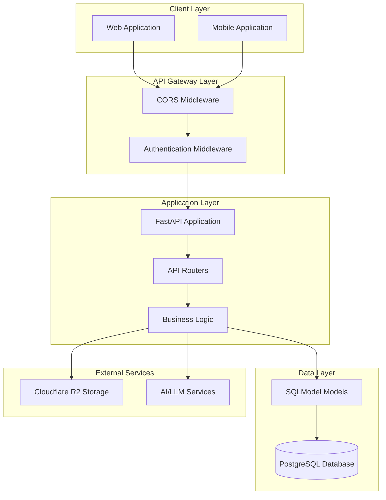

# System Architecture

## Overview

The MNFST-RAG Backend is a FastAPI-based REST API that provides multi-tenant support for a Retrieval-Augmented Generation (RAG) application. The architecture follows a layered design pattern with clear separation of concerns, making it maintainable and scalable.

## High-Level Architecture

## Core Components

### 1. FastAPI Application ([`app/main.py`](../../app/main.py))

The main application entry point that:
- Initializes the FastAPI application with configuration
- Sets up middleware for CORS and authentication
- Includes API routers for different functional areas
- Manages application lifecycle events

### 2. API Layer ([`app/api/`](../../app/api/))

Organized into versioned routers:
- **Authentication** ([`auth.py`](../../app/api/v1/auth.py)) - Login, logout, token management
- **Tenants** ([`tenants.py`](../../app/api/v1/tenants.py)) - Multi-tenant management
- **Users** ([`users.py`](../../app/api/v1/users.py)) - User management and roles
- **Documents** ([`documents.py`](../../app/api/v1/documents.py)) - File upload and RAG processing
- **Social** ([`social.py`](../../app/api/v1/social.py)) - Social media links
- **Chat** ([`chat.py`](../../app/api/v1/chat.py)) - Chat sessions and messaging

### 3. Data Models Layer ([`app/models/`](../../app/models/))

SQLModel-based data models that define:
- **Base Model** ([`base.py`](../../app/models/base.py)) - Common fields and timestamps
- **User Model** ([`user.py`](../../app/models/user.py)) - User entities with role-based access
- **Tenant Model** ([`tenant.py`](../../app/models/tenant.py)) - Multi-tenant organization
- **Document Model** ([`document.py`](../../app/models/document.py)) - File metadata and processing status
- **Social Model** ([`social.py`](../../app/models/social.py)) - Social media links
- **Chat Model** ([`chat.py`](../../app/models/chat.py)) - Chat sessions and messages

### 4. Schemas Layer ([`app/schemas/`](../../app/schemas/))

Pydantic models for API request/response validation:
- Request/response models for each API endpoint
- Data validation and serialization
- Automatic OpenAPI documentation generation

### 5. Utilities Layer ([`app/utils/`](../../app/utils/))

Common utilities and helpers:
- **Logger** ([`logger.py`](../../app/utils/logger.py)) - Structured logging configuration
- **Exceptions** ([`exceptions.py`](../../app/utils/exceptions.py)) - Custom exception handling
- **Mock Data** ([`mock_data.py`](../../app/utils/mock_data.py)) - Test data generation

### 6. Configuration ([`app/config.py`](../../app/config.py))

Centralized configuration management using Pydantic Settings:
- Database connection settings
- CORS configuration
- Application settings
- Environment-specific configurations

### 7. Database Layer ([`app/database.py`](../../app/database.py))

Database connection and session management:
- SQLModel engine configuration
- Database session dependency
- Table creation and migration

## Key Architectural Patterns

### 1. Layered Architecture

The application follows a clean layered architecture:
- **Presentation Layer**: API endpoints and request handling
- **Business Logic Layer**: Services and business rules
- **Data Access Layer**: Models and database operations
- **Infrastructure Layer**: Configuration, logging, and utilities

### 2. Dependency Injection

FastAPI's dependency injection system is used for:
- Database sessions
- Authentication and authorization
- Configuration settings
- Cross-cutting concerns

For detailed information about dependency injection patterns and implementation, see [Dependency Injection Documentation](dependency-injection.md).

### 3. Repository Pattern (Planned)

While not fully implemented, the architecture is designed to support the repository pattern for data access abstraction.

### 4. Multi-Tenant Design

The architecture supports multi-tenancy through:
- Tenant-scoped data models
- Role-based access control
- Tenant isolation at the data level

## Technology Stack

### Core Framework
- **FastAPI**: Modern, fast web framework for building APIs
- **Pydantic**: Data validation and settings management
- **SQLModel**: SQLAlchemy + Pydantic for database models

### Database
- **PostgreSQL**: Primary database (via Supabase)
- **SQLAlchemy**: ORM and database toolkit

### Storage
- **Cloudflare R2**: Object storage for documents (planned)

### Development Tools
- **uv**: Python package manager
- **pytest**: Testing framework
- **black**: Code formatting
- **mypy**: Static type checking

## Security Architecture

### Authentication
- JWT-based authentication (planned implementation)
- Token-based access control
- Refresh token mechanism

### Authorization
- Role-based access control (RBAC)
- Three-tier role hierarchy:
  - **Superadmin**: System-wide access
  - **Tenant Admin**: Tenant-level access
  - **User**: Limited personal access

### Data Security
- Tenant data isolation
- Input validation and sanitization
- CORS protection
- SQL injection prevention through ORM

## Performance Considerations

### Database Optimization
- Indexed queries for common lookups
- Connection pooling
- Query optimization

### Caching Strategy (Planned)
- Redis for session storage
- Application-level caching
- Database query caching

### Scalability
- Stateless API design
- Horizontal scaling support
- Database connection pooling

## Current Implementation Status

### ✅ Implemented
- Complete project structure
- All API endpoints with placeholder implementations
- Data models based on OpenAPI specification
- Mock data generation
- Basic error handling
- Logging configuration
- CORS middleware

### ⏳ In Progress
- Placeholder authentication (no real JWT logic)
- Placeholder database operations (no real persistence)

### 📋 Planned
- Real authentication with JWT tokens
- Database operations with SQLModel
- File upload with Cloudflare R2
- RAG processing for documents
- Streaming for chat responses
- Comprehensive tests
- Rate limiting
- Monitoring and metrics

## Development Workflow

### Local Development
1. Set up development environment with `uv`
2. Configure environment variables
3. Run with `uvicorn` for hot reloading
4. Use mock data for testing

### Testing Strategy
- Unit tests for business logic
- Integration tests for API endpoints
- Mock data for isolated testing
- Test fixtures for consistent test data

### Deployment
- Containerized deployment with Docker
- Environment-specific configurations
- Database migrations
- Health checks and monitoring

## Future Enhancements

### Short Term
- Complete authentication implementation
- Real database operations
- File upload functionality
- Basic RAG processing

### Long Term
- Advanced RAG capabilities
- Real-time chat streaming
- Advanced analytics
- Performance optimization
- Enhanced security features