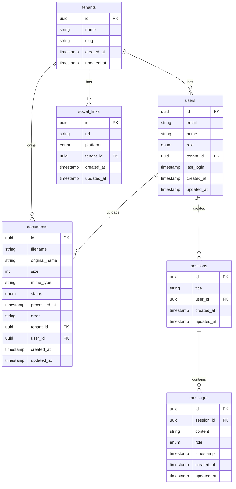

# Database Schema

Complete documentation of the MNFST-RAG database schema, including tables, relationships, indexes, and constraints.

## 📊 Overview

The MNFST-RAG database uses PostgreSQL with SQLModel as the ORM. The schema is designed to support:

- **Multi-tenancy** with complete data isolation
- **Role-based access control** (RBAC)
- **Document management** with RAG processing
- **Chat functionality** with session management
- **Social media integration**

## 🏗️ Entity Relationship Diagram



## 📋 Table Details

### 1. Tenants Table

**Purpose**: Stores multi-tenant organization information

**Table Name**: `tenants`

```sql
CREATE TABLE tenants (
    id UUID PRIMARY KEY DEFAULT gen_random_uuid(),
    name VARCHAR(255) NOT NULL,
    slug VARCHAR(100) UNIQUE NOT NULL,
    created_at TIMESTAMP WITH TIME ZONE DEFAULT NOW(),
    updated_at TIMESTAMP WITH TIME ZONE DEFAULT NOW()
);
```

**Columns**:
- `id` (UUID, Primary Key) - Unique identifier
- `name` (String, Not Null) - Display name of the tenant
- `slug` (String, Unique, Not Null) - URL-safe identifier for the tenant
- `created_at` (Timestamp) - Record creation time
- `updated_at` (Timestamp) - Last update time

**Model**: [`Tenant`](../../app/models/tenant.py)

**Relationships**:
- One-to-many with Users
- One-to-many with Documents
- One-to-many with Social Links

**Indexes**:
- Primary key on `id`
- Unique index on `slug`

### 2. Users Table

**Purpose**: Stores user information with role-based access control

**Table Name**: `users`

```sql
CREATE TABLE users (
    id UUID PRIMARY KEY DEFAULT gen_random_uuid(),
    email VARCHAR(255) NOT NULL,
    name VARCHAR(255),
    role VARCHAR(20) NOT NULL CHECK (role IN ('superadmin', 'tenant_admin', 'user')),
    tenant_id UUID REFERENCES tenants(id) ON DELETE CASCADE,
    last_login TIMESTAMP WITH TIME ZONE,
    created_at TIMESTAMP WITH TIME ZONE DEFAULT NOW(),
    updated_at TIMESTAMP WITH TIME ZONE DEFAULT NOW(),
    UNIQUE(tenant_id, email)
);
```

**Columns**:
- `id` (UUID, Primary Key) - Unique identifier
- `email` (String, Not Null) - User's email address
- `name` (String) - User's full name
- `role` (Enum, Not Null) - User role
- `tenant_id` (UUID, Foreign Key) - Associated tenant (null for superadmin)
- `last_login` (Timestamp) - Last login time
- `created_at` (Timestamp) - Record creation time
- `updated_at` (Timestamp) - Last update time

**Model**: [`User`](../../app/models/user.py)

**Roles**:
- `superadmin` - System-wide access, no tenant association
- `tenant_admin` - Tenant-level administrative access
- `user` - Standard user with limited access

**Relationships**:
- Many-to-one with Tenants
- One-to-many with Documents (as uploader)
- One-to-many with Sessions

**Indexes**:
- Primary key on `id`
- Unique index on `(tenant_id, email)`
- Index on `email` for fast lookups

### 3. Documents Table

**Purpose**: Stores document metadata and processing status

**Table Name**: `documents`

```sql
CREATE TABLE documents (
    id UUID PRIMARY KEY DEFAULT gen_random_uuid(),
    filename VARCHAR(255) NOT NULL,
    original_name VARCHAR(255) NOT NULL,
    size BIGINT NOT NULL,
    mime_type VARCHAR(100) NOT NULL,
    status VARCHAR(20) DEFAULT 'uploaded' CHECK (status IN ('uploaded', 'processing', 'processed', 'error')),
    processed_at TIMESTAMP WITH TIME ZONE,
    error TEXT,
    tenant_id UUID NOT NULL REFERENCES tenants(id) ON DELETE CASCADE,
    user_id UUID NOT NULL REFERENCES users(id) ON DELETE CASCADE,
    created_at TIMESTAMP WITH TIME ZONE DEFAULT NOW(),
    updated_at TIMESTAMP WITH TIME ZONE DEFAULT NOW()
);
```

**Columns**:
- `id` (UUID, Primary Key) - Unique identifier
- `filename` (String, Not Null) - System-generated filename
- `original_name` (String, Not Null) - Original upload filename
- `size` (BigInt, Not Null) - File size in bytes
- `mime_type` (String, Not Null) - MIME type of the file
- `status` (Enum) - Processing status
- `processed_at` (Timestamp) - Processing completion time
- `error` (Text) - Error message if processing failed
- `tenant_id` (UUID, Foreign Key) - Owning tenant
- `user_id` (UUID, Foreign Key) - User who uploaded
- `created_at` (Timestamp) - Record creation time
- `updated_at` (Timestamp) - Last update time

**Model**: [`Document`](../../app/models/document.py)

**Status Values**:
- `uploaded` - File uploaded, awaiting processing
- `processing` - Currently being processed for RAG
- `processed` - Successfully processed and indexed
- `error` - Processing failed

**Relationships**:
- Many-to-one with Tenants
- Many-to-one with Users

**Indexes**:
- Primary key on `id`
- Foreign key index on `tenant_id`
- Foreign key index on `user_id`
- Composite index on `(tenant_id, status)`
- Composite index on `(tenant_id, created_at)`

### 4. Social Links Table

**Purpose**: Stores social media links for tenants

**Table Name**: `social_links`

```sql
CREATE TABLE social_links (
    id UUID PRIMARY KEY DEFAULT gen_random_uuid(),
    url VARCHAR(500) NOT NULL,
    platform VARCHAR(50) NOT NULL,
    tenant_id UUID NOT NULL REFERENCES tenants(id) ON DELETE CASCADE,
    created_at TIMESTAMP WITH TIME ZONE DEFAULT NOW(),
    updated_at TIMESTAMP WITH TIME ZONE DEFAULT NOW()
);
```

**Columns**:
- `id` (UUID, Primary Key) - Unique identifier
- `url` (String, Not Null) - Social media URL
- `platform` (String, Not Null) - Social media platform
- `tenant_id` (UUID, Foreign Key) - Associated tenant
- `created_at` (Timestamp) - Record creation time
- `updated_at` (Timestamp) - Last update time

**Model**: [`SocialLink`](../../app/models/social.py)

**Platform Values**:
- `twitter`
- `facebook`
- `linkedin`
- `instagram`
- `youtube`
- `github`

**Relationships**:
- Many-to-one with Tenants

**Indexes**:
- Primary key on `id`
- Foreign key index on `tenant_id`
- Composite index on `(tenant_id, platform)`

### 5. Chat Sessions Table

**Purpose**: Stores chat session information

**Table Name**: `sessions`

```sql
CREATE TABLE sessions (
    id UUID PRIMARY KEY DEFAULT gen_random_uuid(),
    title VARCHAR(255) NOT NULL,
    user_id UUID NOT NULL REFERENCES users(id) ON DELETE CASCADE,
    created_at TIMESTAMP WITH TIME ZONE DEFAULT NOW(),
    updated_at TIMESTAMP WITH TIME ZONE DEFAULT NOW()
);
```

**Columns**:
- `id` (UUID, Primary Key) - Unique identifier
- `title` (String, Not Null) - Session title
- `user_id` (UUID, Foreign Key) - Session owner
- `created_at` (Timestamp) - Record creation time
- `updated_at` (Timestamp) - Last update time

**Model**: [`Session`](../../app/models/chat.py)

**Relationships**:
- Many-to-one with Users
- One-to-many with Messages

**Indexes**:
- Primary key on `id`
- Foreign key index on `user_id`
- Index on `updated_at` for sorting

### 6. Messages Table

**Purpose**: Stores chat messages within sessions

**Table Name**: `messages`

```sql
CREATE TABLE messages (
    id UUID PRIMARY KEY DEFAULT gen_random_uuid(),
    session_id UUID NOT NULL REFERENCES sessions(id) ON DELETE CASCADE,
    content TEXT NOT NULL,
    role VARCHAR(20) NOT NULL CHECK (role IN ('user', 'assistant')),
    timestamp TIMESTAMP WITH TIME ZONE DEFAULT NOW(),
    created_at TIMESTAMP WITH TIME ZONE DEFAULT NOW(),
    updated_at TIMESTAMP WITH TIME ZONE DEFAULT NOW()
);
```

**Columns**:
- `id` (UUID, Primary Key) - Unique identifier
- `session_id` (UUID, Foreign Key) - Associated session
- `content` (Text, Not Null) - Message content
- `role` (Enum, Not Null) - Message role
- `timestamp` (Timestamp) - Message timestamp
- `created_at` (Timestamp) - Record creation time
- `updated_at` (Timestamp) - Last update time

**Model**: [`Message`](../../app/models/chat.py)

**Role Values**:
- `user` - Message from user
- `assistant` - Response from AI assistant

**Relationships**:
- Many-to-one with Sessions

**Indexes**:
- Primary key on `id`
- Foreign key index on `session_id`
- Composite index on `(session_id, timestamp)`

## 🔒 Row Level Security

### Enable RLS

```sql
-- Enable Row Level Security on tenant-specific tables
ALTER TABLE users ENABLE ROW LEVEL SECURITY;
ALTER TABLE documents ENABLE ROW LEVEL SECURITY;
ALTER TABLE social_links ENABLE ROW LEVEL SECURITY;
ALTER TABLE sessions ENABLE ROW LEVEL SECURITY;
ALTER TABLE messages ENABLE ROW LEVEL SECURITY;
```

### RLS Policies

```sql
-- Users can only see users from their tenant (except superadmin)
CREATE POLICY tenant_isolation_users ON users
    FOR ALL TO authenticated
    USING (
        tenant_id = current_setting('app.current_tenant_id')::uuid 
        OR current_setting('app.user_role') = 'superadmin'
    );

-- Documents isolation
CREATE POLICY tenant_isolation_documents ON documents
    FOR ALL TO authenticated
    USING (tenant_id = current_setting('app.current_tenant_id')::uuid);

-- Social links isolation
CREATE POLICY tenant_isolation_social_links ON social_links
    FOR ALL TO authenticated
    USING (tenant_id = current_setting('app.current_tenant_id')::uuid);

-- Sessions isolation (through user ownership)
CREATE POLICY user_isolation_sessions ON sessions
    FOR ALL TO authenticated
    USING (
        user_id = current_setting('app.current_user_id')::uuid
        OR current_setting('app.user_role') IN ('superadmin', 'tenant_admin')
    );

-- Messages isolation (through session ownership)
CREATE POLICY session_isolation_messages ON messages
    FOR ALL TO authenticated
    USING (
        session_id IN (
            SELECT id FROM sessions 
            WHERE user_id = current_setting('app.current_user_id')::uuid
        )
        OR current_setting('app.user_role') IN ('superadmin', 'tenant_admin')
    );
```

## 🔧 Database Functions

### Context Setting

```sql
-- Function to set user and tenant context
CREATE OR REPLACE FUNCTION set_user_context(user_uuid UUID)
RETURNS void AS $$
DECLARE
    user_tenant_id UUID;
    user_role VARCHAR(20);
BEGIN
    -- Get user's tenant and role
    SELECT tenant_id, role INTO user_tenant_id, user_role
    FROM users
    WHERE id = user_uuid;
    
    -- Set context variables for RLS
    PERFORM set_config('app.current_user_id', user_uuid::text, true);
    PERFORM set_config('app.current_tenant_id', COALESCE(user_tenant_id::text, ''), true);
    PERFORM set_config('app.user_role', user_role, true);
END;
$$ LANGUAGE plpgsql SECURITY DEFINER;
```

### Automated Timestamps

```sql
-- Function to update updated_at timestamp
CREATE OR REPLACE FUNCTION update_updated_at_column()
RETURNS TRIGGER AS $$
BEGIN
    NEW.updated_at = NOW();
    RETURN NEW;
END;
$$ LANGUAGE plpgsql;

-- Triggers for automatic timestamp updates
CREATE TRIGGER update_tenants_updated_at
    BEFORE UPDATE ON tenants
    FOR EACH ROW
    EXECUTE FUNCTION update_updated_at_column();

CREATE TRIGGER update_users_updated_at
    BEFORE UPDATE ON users
    FOR EACH ROW
    EXECUTE FUNCTION update_updated_at_column();

CREATE TRIGGER update_documents_updated_at
    BEFORE UPDATE ON documents
    FOR EACH ROW
    EXECUTE FUNCTION update_updated_at_column();

CREATE TRIGGER update_social_links_updated_at
    BEFORE UPDATE ON social_links
    FOR EACH ROW
    EXECUTE FUNCTION update_updated_at_column();

CREATE TRIGGER update_sessions_updated_at
    BEFORE UPDATE ON sessions
    FOR EACH ROW
    EXECUTE FUNCTION update_updated_at_column();

CREATE TRIGGER update_messages_updated_at
    BEFORE UPDATE ON messages
    FOR EACH ROW
    EXECUTE FUNCTION update_updated_at_column();
```

## 📈 Indexes and Performance

### Primary Indexes

All tables have primary key indexes on their `id` column.

### Foreign Key Indexes

```sql
-- User relationships
CREATE INDEX idx_users_tenant_id ON users(tenant_id);
CREATE INDEX idx_sessions_user_id ON sessions(user_id);

-- Document relationships
CREATE INDEX idx_documents_tenant_id ON documents(tenant_id);
CREATE INDEX idx_documents_user_id ON documents(user_id);

-- Social links
CREATE INDEX idx_social_links_tenant_id ON social_links(tenant_id);

-- Messages
CREATE INDEX idx_messages_session_id ON messages(session_id);
```

### Composite Indexes

```sql
-- Tenant-specific queries
CREATE INDEX idx_users_tenant_email ON users(tenant_id, email);
CREATE INDEX idx_documents_tenant_status ON documents(tenant_id, status);
CREATE INDEX idx_documents_tenant_created ON documents(tenant_id, created_at DESC);
CREATE INDEX idx_social_links_tenant_platform ON social_links(tenant_id, platform);

-- Session queries
CREATE INDEX idx_sessions_user_updated ON sessions(user_id, updated_at DESC);
CREATE INDEX idx_messages_session_timestamp ON messages(session_id, timestamp);
```

### Full-Text Search

```sql
-- Full-text search for message content
CREATE INDEX idx_messages_content_fts ON messages USING gin(to_tsvector('english', content));

-- Full-text search for document names
CREATE INDEX idx_documents_name_fts ON documents USING gin(to_tsvector('english', original_name));
```

## 🔍 Data Validation

### Check Constraints

```sql
-- Email validation
ALTER TABLE users ADD CONSTRAINT valid_email 
    CHECK (email ~* '^[A-Za-z0-9._%+-]+@[A-Za-z0-9.-]+\.[A-Za-z]{2,}$');

-- URL validation for social links
ALTER TABLE social_links ADD CONSTRAINT valid_url 
    CHECK (url ~* '^https?://[^\s/$.?#].[^\s]*$');

-- File size validation
ALTER TABLE documents ADD CONSTRAINT valid_file_size 
    CHECK (size > 0 AND size <= 52428800); -- 50MB max

-- Tenant slug validation
ALTER TABLE tenants ADD CONSTRAINT valid_slug 
    CHECK (slug ~* '^[a-z0-9-]+$');
```

### Trigger-based Validation

```sql
-- Function to validate tenant slug
CREATE OR REPLACE FUNCTION validate_tenant_slug()
RETURNS TRIGGER AS $$
BEGIN
    IF NEW.slug ~* '[^a-z0-9-]' THEN
        RAISE EXCEPTION 'Tenant slug can only contain lowercase letters, numbers, and hyphens';
    END IF;
    
    RETURN NEW;
END;
$$ LANGUAGE plpgsql;

-- Trigger for tenant validation
CREATE TRIGGER validate_tenant_slug_trigger
    BEFORE INSERT OR UPDATE ON tenants
    FOR EACH ROW
    EXECUTE FUNCTION validate_tenant_slug();
```

## 📊 Statistics and Monitoring

### Table Sizes

```sql
-- Monitor table sizes
SELECT 
    schemaname,
    tablename,
    pg_size_pretty(pg_total_relation_size(schemaname||'.'||tablename)) as size,
    pg_size_pretty(pg_relation_size(schemaname||'.'||tablename)) as table_size,
    pg_size_pretty(pg_total_relation_size(schemaname||'.'||tablename) - pg_relation_size(schemaname||'.'||tablename)) as index_size
FROM pg_tables
WHERE schemaname = 'public'
ORDER BY pg_total_relation_size(schemaname||'.'||tablename) DESC;
```

### Index Usage

```sql
-- Monitor index effectiveness
SELECT 
    schemaname,
    tablename,
    indexname,
    idx_scan,
    idx_tup_read,
    idx_tup_fetch,
    pg_size_pretty(pg_relation_size(schemaname||'.'||indexname)) as index_size
FROM pg_stat_user_indexes
WHERE schemaname = 'public'
ORDER BY idx_scan DESC;
```

## 🔄 Migration Strategy

### Initial Setup

```sql
-- Create extensions
CREATE EXTENSION IF NOT EXISTS "uuid-ossp";
CREATE EXTENSION IF NOT EXISTS "pgcrypto";

-- Create tables in dependency order
-- 1. tenants (no dependencies)
-- 2. users (depends on tenants)
-- 3. sessions (depends on users)
-- 4. messages (depends on sessions)
-- 5. documents (depends on tenants, users)
-- 6. social_links (depends on tenants)
```

### Version Control

```sql
-- Migration version table
CREATE TABLE IF NOT EXISTS schema_migrations (
    version VARCHAR(255) PRIMARY KEY,
    applied_at TIMESTAMP WITH TIME ZONE DEFAULT NOW()
);

-- Track migrations
INSERT INTO schema_migrations (version) VALUES ('001_initial_schema');
INSERT INTO schema_migrations (version) VALUES ('002_add_rls_policies');
INSERT INTO schema_migrations (version) VALUES ('003_add_indexes');
```

## 🔮 Future Enhancements

### Planned Schema Changes

1. **Audit Trail**: Add audit tables for change tracking
2. **Soft Deletes**: Implement soft delete functionality
3. **Document Chunks**: Table for RAG document chunks
4. **Embeddings**: Table for vector embeddings
5. **User Preferences**: Table for user settings
6. **API Keys**: Table for API key management

### Performance Improvements

1. **Partitioning**: Table partitioning for large datasets
2. **Materialized Views**: For complex reporting queries
3. **Connection Pooling**: Optimized database connections
4. **Caching Layer**: Redis for frequently accessed data

---

**Related Documentation**:
- [Setup Guide](./setup.md) - Database initialization and migration
- [Configuration](./configuration.md) - Database configuration and connections
- [Troubleshooting](./troubleshooting.md) - Common issues and solutions

**Model Files**:
- [`Tenant`](../../app/models/tenant.py)
- [`User`](../../app/models/user.py)
- [`Document`](../../app/models/document.py)
- [`SocialLink`](../../app/models/social.py)
- [`Session`](../../app/models/chat.py)
- [`Message`](../../app/models/chat.py)