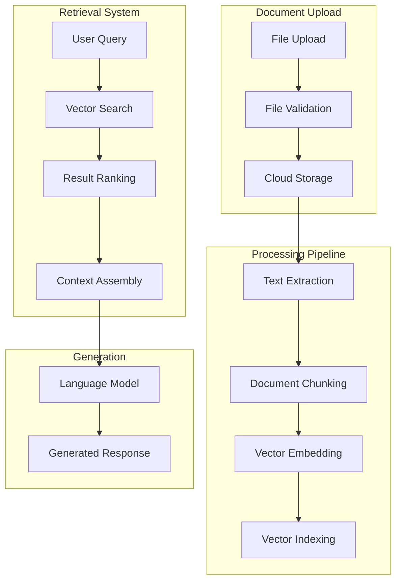
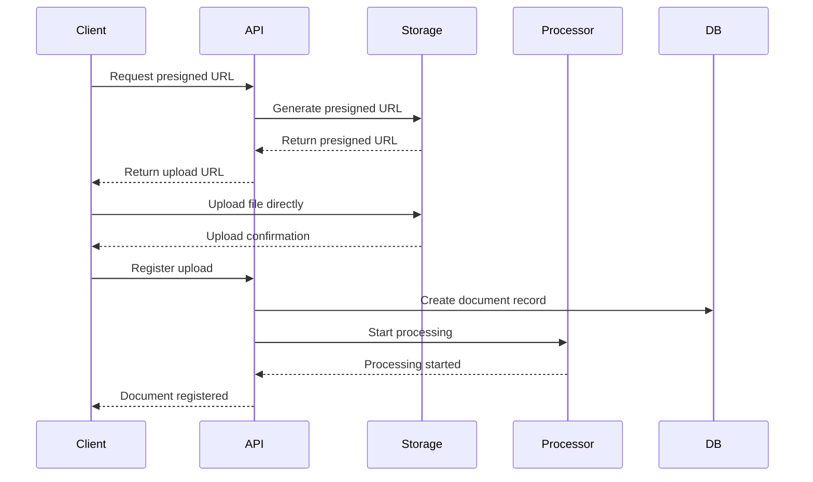

# Document Processing and RAG Implementation

## Overview

The MNFST-RAG Backend implements a comprehensive document processing pipeline with Retrieval-Augmented Generation (RAG) capabilities. This system allows users to upload documents, which are then processed, chunked, embedded, and made available for intelligent search and retrieval in chat conversations.

## RAG Architecture



## Document Upload Process

### 1. File Upload Flow



### 2. Supported File Types

| Category | Formats | Processing Method |
|----------|---------|-------------------|
| Text | `.txt`, `.md`, `.rst` | Direct text extraction |
| PDF | `.pdf` | PDF text extraction |
| Office | `.docx`, `.xlsx`, `.pptx` | LibreOffice conversion |
| Web | `.html`, `.htm` | HTML parsing |
| Images | `.png`, `.jpg`, `.jpeg` | OCR processing (planned) |

### 3. File Size Limits

- **Maximum file size**: 50MB per document
- **Maximum files per tenant**: Configurable (default: 1000)
- **Maximum storage per tenant**: Configurable (default: 10GB)

## Document Processing Pipeline

### 1. Text Extraction

```python
# app/services/document_extraction.py
class DocumentExtractor:
    def extract_text(self, file_path: str, mime_type: str) -> str:
        """Extract text from various file formats"""
        
        if mime_type == "text/plain":
            return self._extract_from_text(file_path)
        elif mime_type == "application/pdf":
            return self._extract_from_pdf(file_path)
        elif mime_type.startswith("application/vnd.openxmlformats"):
            return self._extract_from_office(file_path)
        elif mime_type == "text/html":
            return self._extract_from_html(file_path)
        else:
            raise UnsupportedFileTypeError(f"Unsupported MIME type: {mime_type}")
    
    def _extract_from_pdf(self, file_path: str) -> str:
        """Extract text from PDF using PyPDF2 or pdfplumber"""
        import pdfplumber
        
        text = ""
        with pdfplumber.open(file_path) as pdf:
            for page in pdf.pages:
                text += page.extract_text() + "\n"
        
        return text
    
    def _extract_from_office(self, file_path: str) -> str:
        """Extract text from Office documents using python-docx"""
        if file_path.endswith('.docx'):
            from docx import Document
            doc = Document(file_path)
            return "\n".join([paragraph.text for paragraph in doc.paragraphs])
        # Similar implementations for .xlsx, .pptx
```

### 2. Document Chunking

```python
# app/services/document_chunking.py
class DocumentChunker:
    def __init__(self, chunk_size: int = 1000, overlap: int = 200):
        self.chunk_size = chunk_size
        self.overlap = overlap
    
    def chunk_document(self, text: str, metadata: dict) -> List[DocumentChunk]:
        """Split document into overlapping chunks"""
        
        # Split by paragraphs first
        paragraphs = text.split('\n\n')
        chunks = []
        current_chunk = ""
        current_size = 0
        
        for paragraph in paragraphs:
            if current_size + len(paragraph) > self.chunk_size:
                if current_chunk:
                    chunks.append(self._create_chunk(
                        current_chunk, metadata, len(chunks)
                    ))
                
                # Start new chunk with overlap
                current_chunk = self._get_overlap_text(current_chunk) + paragraph
                current_size = len(current_chunk)
            else:
                current_chunk += paragraph + "\n\n"
                current_size += len(paragraph) + 2
        
        # Add final chunk
        if current_chunk:
            chunks.append(self._create_chunk(
                current_chunk, metadata, len(chunks)
            ))
        
        return chunks
    
    def _create_chunk(self, text: str, metadata: dict, index: int) -> DocumentChunk:
        """Create a document chunk with metadata"""
        return DocumentChunk(
            content=text.strip(),
            metadata={
                **metadata,
                "chunk_index": index,
                "chunk_size": len(text),
                "created_at": datetime.utcnow()
            }
        )
```

### 3. Vector Embedding

```python
# app/services/embedding.py
class EmbeddingService:
    def __init__(self, model: str = "text-embedding-ada-002"):
        self.model = model
        self.client = OpenAI(api_key=settings.openai_api_key)
    
    async def create_embeddings(self, texts: List[str]) -> List[List[float]]:
        """Create vector embeddings for text chunks"""
        
        # Process in batches to avoid rate limits
        batch_size = 100
        all_embeddings = []
        
        for i in range(0, len(texts), batch_size):
            batch = texts[i:i + batch_size]
            response = await self.client.embeddings.create(
                model=self.model,
                input=batch
            )
            
            batch_embeddings = [item.embedding for item in response.data]
            all_embeddings.extend(batch_embeddings)
        
        return all_embeddings
    
    async def embed_chunks(self, chunks: List[DocumentChunk]) -> List[VectorChunk]:
        """Embed document chunks"""
        texts = [chunk.content for chunk in chunks]
        embeddings = await self.create_embeddings(texts)
        
        vector_chunks = []
        for chunk, embedding in zip(chunks, embeddings):
            vector_chunks.append(VectorChunk(
                id=chunk.id,
                content=chunk.content,
                metadata=chunk.metadata,
                embedding=embedding,
                tenant_id=chunk.metadata.get("tenant_id"),
                document_id=chunk.metadata.get("document_id")
            ))
        
        return vector_chunks
```

### 4. Vector Storage and Indexing

```python
# app/services/vector_store.py
class VectorStore:
    def __init__(self):
        # Using pgvector for PostgreSQL
        self.db = get_database_connection()
    
    async def store_vectors(self, vectors: List[VectorChunk]) -> None:
        """Store vector embeddings in database"""
        
        query = """
        INSERT INTO document_vectors (id, content, metadata, embedding, tenant_id, document_id)
        VALUES ($1, $2, $3, $4, $5, $6)
        """
        
        for vector in vectors:
            await self.db.execute(query, (
                vector.id,
                vector.content,
                json.dumps(vector.metadata),
                vector.embedding,
                vector.tenant_id,
                vector.document_id
            ))
    
    async def search_similar(
        self, 
        query_embedding: List[float], 
        tenant_id: UUID,
        limit: int = 5,
        threshold: float = 0.7
    ) -> List[VectorChunk]:
        """Search for similar vectors using cosine similarity"""
        
        query = """
        SELECT id, content, metadata, embedding, document_id,
               1 - (embedding <=> $1) as similarity
        FROM document_vectors
        WHERE tenant_id = $2
        AND 1 - (embedding <=> $1) > $3
        ORDER BY similarity DESC
        LIMIT $4
        """
        
        results = await self.db.fetch_all(query, (
            query_embedding, tenant_id, threshold, limit
        ))
        
        return [VectorChunk.from_db_row(row) for row in results]
```

## RAG Query Processing

### 1. Query Understanding

```python
# app/services/query_processor.py
class QueryProcessor:
    def __init__(self):
        self.llm = OpenAI(api_key=settings.openai_api_key)
    
    async def process_query(self, query: str, context: dict) -> ProcessedQuery:
        """Process and understand user query"""
        
        # Extract key entities and intent
        entities = await self._extract_entities(query)
        intent = await self._classify_intent(query)
        
        # Expand query with synonyms
        expanded_query = await self._expand_query(query)
        
        return ProcessedQuery(
            original=query,
            expanded=expanded_query,
            entities=entities,
            intent=intent,
            context=context
        )
    
    async def _extract_entities(self, query: str) -> List[Entity]:
        """Extract named entities from query"""
        # Implementation using spaCy or similar
        pass
    
    async def _classify_intent(self, query: str) -> str:
        """Classify user intent"""
        # Implementation using classification model
        pass
```

### 2. Context Retrieval

```python
# app/services/context_retriever.py
class ContextRetriever:
    def __init__(self):
        self.embedding_service = EmbeddingService()
        self.vector_store = VectorStore()
    
    async def retrieve_context(
        self, 
        query: str, 
        tenant_id: UUID,
        max_context_length: int = 4000
    ) -> RetrievalContext:
        """Retrieve relevant context for query"""
        
        # Create query embedding
        query_embedding = await self.embedding_service.create_embeddings([query])
        
        # Search for similar documents
        similar_chunks = await self.vector_store.search_similar(
            query_embedding[0], tenant_id
        )
        
        # Rank and select best chunks
        selected_chunks = self._rank_and_select(
            similar_chunks, max_context_length
        )
        
        # Assemble context
        context = self._assemble_context(selected_chunks)
        
        return RetrievalContext(
            query=query,
            chunks=selected_chunks,
            context_text=context,
            sources=[chunk.document_id for chunk in selected_chunks]
        )
    
    def _rank_and_select(
        self, 
        chunks: List[VectorChunk], 
        max_length: int
    ) -> List[VectorChunk]:
        """Rank and select chunks based on relevance and diversity"""
        
        # Implement ranking algorithm
        # Consider relevance, diversity, and length constraints
        pass
```

### 3. Response Generation

```python
# app/services/response_generator.py
class ResponseGenerator:
    def __init__(self):
        self.llm = OpenAI(api_key=settings.openai_api_key)
    
    async def generate_response(
        self, 
        query: str, 
        context: RetrievalContext,
        conversation_history: List[Message] = None
    ) -> GeneratedResponse:
        """Generate response using RAG"""
        
        # Build prompt with context
        prompt = self._build_prompt(query, context, conversation_history)
        
        # Generate response
        response = await self.llm.chat.completions.create(
            model="gpt-4",
            messages=[
                {"role": "system", "content": self._get_system_prompt()},
                {"role": "user", "content": prompt}
            ],
            temperature=0.7,
            max_tokens=1000
        )
        
        return GeneratedResponse(
            content=response.choices[0].message.content,
            sources=context.sources,
            context_used=context.chunks,
            metadata={
                "model": "gpt-4",
                "tokens_used": response.usage.total_tokens,
                "context_length": len(context.context_text)
            }
        )
    
    def _build_prompt(
        self, 
        query: str, 
        context: RetrievalContext,
        history: List[Message]
    ) -> str:
        """Build prompt with context and conversation history"""
        
        prompt = f"""Using the following context, please answer the user's question.

Context:
{context.context_text}

Question: {query}

Please provide a comprehensive answer based on the provided context. If the context doesn't contain enough information to answer the question, please say so.

"""
        
        # Add conversation history if available
        if history:
            prompt += "\n\nPrevious conversation:\n"
            for msg in history[-5:]:  # Last 5 messages
                prompt += f"{msg.role}: {msg.content}\n"
        
        return prompt
```

## Document Status Tracking

### Processing States

```python
# app/models/document.py
class DocumentStatus(str, Enum):
    UPLOADED = "uploaded"           # File uploaded, awaiting processing
    EXTRACTING = "extracting"       # Extracting text from file
    CHUNKING = "chunking"          # Splitting into chunks
    EMBEDDING = "embedding"        # Creating vector embeddings
    INDEXING = "indexing"          # Indexing in vector store
    PROCESSED = "processed"        # Successfully processed
    ERROR = "error"                # Processing failed
```

### Status Updates

```python
# app/services/document_processor.py
class DocumentProcessor:
    async def process_document(self, document_id: UUID) -> None:
        """Process document through the entire pipeline"""
        
        try:
            await self._update_status(document_id, DocumentStatus.EXTRACTING)
            text = await self.extractor.extract_text(document.file_path, document.mime_type)
            
            await self._update_status(document_id, DocumentStatus.CHUNKING)
            chunks = await self.chunker.chunk_document(text, document.metadata)
            
            await self._update_status(document_id, DocumentStatus.EMBEDDING)
            vector_chunks = await self.embedding_service.embed_chunks(chunks)
            
            await self._update_status(document_id, DocumentStatus.INDEXING)
            await self.vector_store.store_vectors(vector_chunks)
            
            await self._update_status(document_id, DocumentStatus.PROCESSED)
            
        except Exception as e:
            await self._update_status(document_id, DocumentStatus.ERROR, str(e))
            logger.error(f"Document processing failed: {e}")
```

## API Endpoints

### Document Management

```python
# app/api/v1/documents.py
@router.post("/presigned-url")
async def get_presigned_url(
    request: PresignedUrlRequest,
    current_user: User = Depends(get_current_user)
):
    """Get presigned URL for direct upload"""
    
    # Validate file size and type
    if request.size > MAX_FILE_SIZE:
        raise HTTPException(status_code=413, detail="File too large")
    
    if request.mime_type not in SUPPORTED_MIME_TYPES:
        raise HTTPException(status_code=400, detail="Unsupported file type")
    
    # Generate presigned URL
    file_key = f"{current_user.tenant_id}/{uuid4()}/{request.original_name}"
    upload_url = storage_service.generate_presigned_url(file_key, request.mime_type)
    
    return PresignedUrlResponse(
        upload_url=upload_url,
        file_key=file_key,
        document_id=uuid4(),
        public_url=f"{settings.r2_public_url}/{file_key}"
    )

@router.post("/register-upload")
async def register_upload(
    request: RegisterUploadRequest,
    current_user: User = Depends(get_current_user),
    db: Session = Depends(get_session)
):
    """Register uploaded document and start processing"""
    
    # Create document record
    document = Document(
        id=request.document_id,
        filename=request.file_name,
        original_name=request.file_name,
        size=request.file_size,
        mime_type=request.mime_type,
        status=DocumentStatus.UPLOADED,
        tenant_id=current_user.tenant_id,
        user_id=current_user.id
    )
    
    db.add(document)
    db.commit()
    
    # Start async processing
    background_tasks.add_task(process_document_background, document.id)
    
    return {"success": True, "document_id": document.id}

@router.get("/upload/{upload_id}/status")
async def get_upload_status(
    upload_id: UUID,
    current_user: User = Depends(get_current_user),
    db: Session = Depends(get_session)
):
    """Get document processing status"""
    
    document = db.get(Document, upload_id)
    if not document or document.tenant_id != current_user.tenant_id:
        raise HTTPException(status_code=404, detail="Document not found")
    
    return DocumentUploadStatus(
        id=document.id,
        filename=document.original_name,
        status=document.status,
        progress=get_progress_percentage(document.status),
        processed_at=document.processed_at,
        error=document.error
    )
```

## Performance Optimization

### 1. Batch Processing

```python
# Process documents in batches to improve efficiency
class BatchProcessor:
    async def process_batch(self, document_ids: List[UUID]) -> None:
        """Process multiple documents in batch"""
        
        # Extract text for all documents
        texts = await self._batch_extract(document_ids)
        
        # Create embeddings in batch
        all_chunks = []
        for doc_id, text in zip(document_ids, texts):
            chunks = await self.chunker.chunk_document(text, doc_id)
            all_chunks.extend(chunks)
        
        # Batch embed all chunks
        vector_chunks = await self.embedding_service.embed_chunks(all_chunks)
        
        # Store in batch
        await self.vector_store.store_vectors_batch(vector_chunks)
```

### 2. Caching Strategy

```python
# Cache embeddings and processed content
class CacheManager:
    def __init__(self):
        self.redis = Redis(settings.redis_url)
    
    async def get_cached_embedding(self, text_hash: str) -> Optional[List[float]]:
        """Get cached embedding"""
        return await self.redis.get(f"embedding:{text_hash}")
    
    async def cache_embedding(self, text_hash: str, embedding: List[float]) -> None:
        """Cache embedding for future use"""
        await self.redis.setex(
            f"embedding:{text_hash}", 
            86400,  # 24 hours
            json.dumps(embedding)
        )
```

## Monitoring and Analytics

### Processing Metrics

```python
# Track processing performance and success rates
class ProcessingMetrics:
    async def track_processing_time(self, document_id: UUID, stage: str, duration: float) -> None:
        """Track processing time for each stage"""
        
        await metrics_collector.record(
            "document_processing_duration",
            duration,
            tags={
                "stage": stage,
                "tenant_id": str(get_tenant_id(document_id))
            }
        )
    
    async def track_success_rate(self, status: DocumentStatus) -> None:
        """Track processing success rates"""
        
        await metrics_collector.increment(
            "document_processing_status",
            tags={"status": status.value}
        )
```

## Future Enhancements

### 1. Advanced Chunking Strategies

- Semantic chunking using sentence embeddings
- Hierarchical chunking for long documents
- Adaptive chunk size based on content type

### 2. Multi-Modal Processing

- Image and video processing
- Audio transcription
- Table extraction and analysis

### 3. Advanced Retrieval

- Hybrid search (vector + keyword)
- Re-ranking using cross-encoders
- Query expansion and reformulation

### 4. Personalization

- User-specific relevance scoring
- Learning from user feedback
- Personalized result ranking

### 5. Scalability Improvements

- Distributed processing
- GPU acceleration for embeddings
- Streaming processing for large files